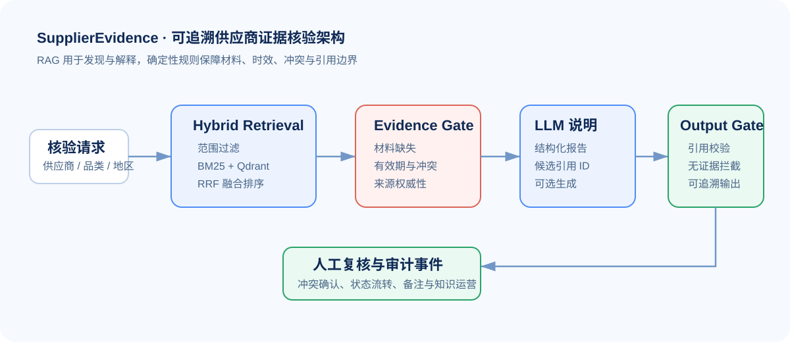
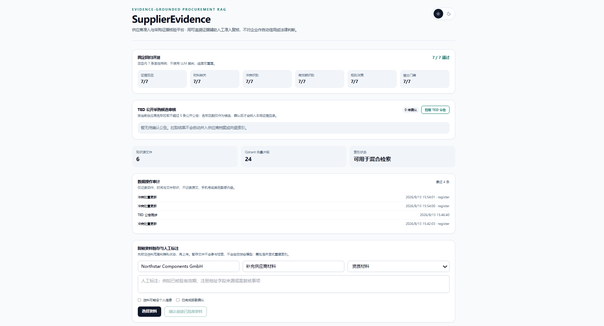
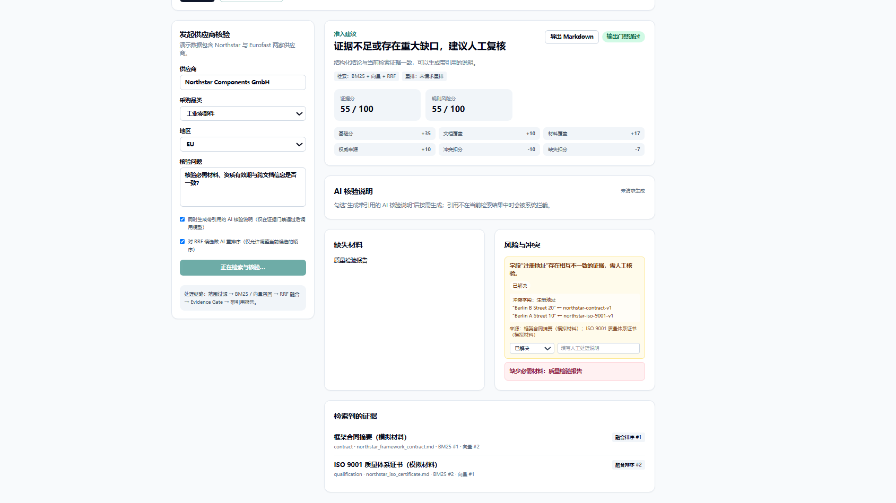
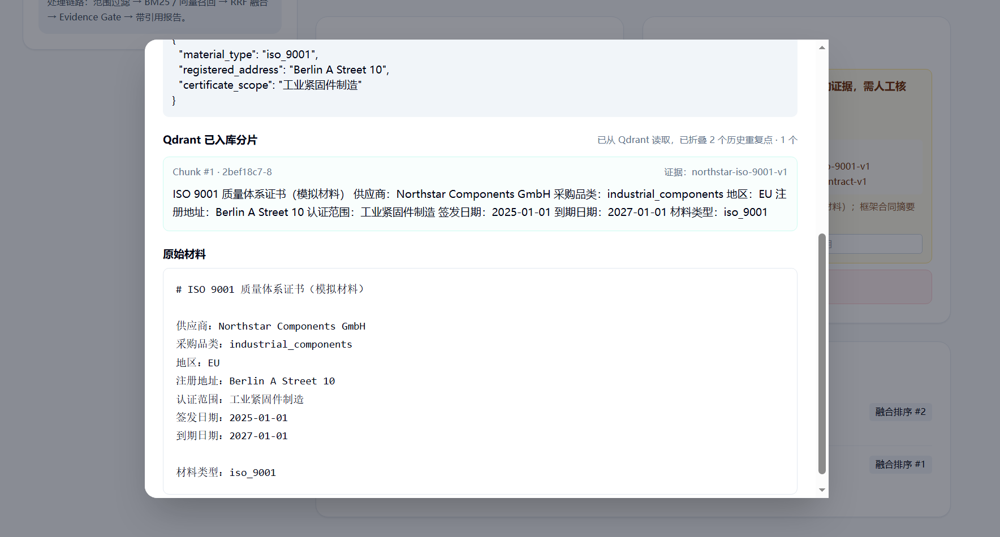

# SupplierEvidence｜供应商准入与采购证据核验 RAG 平台

> 从“检索到一段文本”升级为“给出有来源、可核验、可人工处置的供应商证据”。


SupplierEvidence 面向采购与供应商准入复核场景：输入供应商、采购品类、地区与核验问题，系统跨合同、资质、质量材料、历史评审与经人工确认的公开采购公告检索证据，识别**材料缺口、时效风险与跨文档冲突**，输出可追溯的人工复核建议。

> 这是辅助人工复核的证据系统，不对企业作自动信用、法律或制裁判断。

<p align="center">
  
</p>

| Hybrid Retrieval | Evidence Gate | Output Gate | 人工复核与审计 |
| :---: | :---: | :---: | :---: |
| BM25 + Qdrant + RRF | 材料、时效、冲突 | 引用校验、无证据拦截 | 状态流转与备注 |

## 01. 问题定义

供应商准入材料往往分散在合同、营业资质、认证证书、质量文件、历史评审与公开采购信息中。传统“问答式 RAG”只会给出相似文本，无法稳定回答：

- 准入所需材料是否齐全？
- 证照是否仍在有效期内？
- 不同文档的注册地址、认证范围等字段是否冲突？
- 报告中的每个判断能否追溯到当前检索到的证据？

因此，本项目将 LLM 放在“证据发现与解释”位置，将材料完整性、时效、冲突与引用合法性放在可验证的规则门禁中。

## 02. 核心设计：Hybrid Retrieval + 双门禁

```text
供应商 + 品类 + 地区 + 核验问题
                 │
                 ▼
范围过滤 → BM25 + 向量召回 → RRF 融合排序
                                  │
                                  ▼
                   Evidence Gate（材料 / 时效 / 冲突）
                                  │
                                  ▼
                   可追溯证据、缺口、冲突与评分
                                  │
                                  ▼
                Output Gate（引用合法性 / 无证据拦截）
                                  │
                                  ▼
                         带引用的 AI 说明（可选）
```

## 03. 产品设计与功能实现

| 模块 | 实现与价值 |
| --- | --- |
| Hybrid Retrieval | 先按供应商、品类、地区硬过滤，再融合 BM25 词法检索与 Qdrant 向量召回，使用 RRF 排序；向量服务不可用时明确降级为 BM25。 |
| Evidence Gate | 用确定性规则检查准入必备材料、证照有效期、来源权威性，以及注册地址 / 认证范围等跨文档冲突。 |
| Output Gate | 拦截“无检索证据”“引用不属于当前结果”“冲突结论缺少证据”的输出；模型产生的证据 ID 会二次校验。 |
| 可解释检索 | 展示 BM25、向量、RRF 的排名，可查看来源元数据、原始材料和 Qdrant 实际入库分片。 |
| 冲突人工处置 | 显示冲突字段、不同取值和对应证据；支持待确认 / 已确认 / 已解决与人工备注，并记录审计事件。 |
| 受控知识运营 | 文件先暂存，完成隐私确认和人工批准后才能显式重建索引；支持 Markdown、TXT、CSV、PDF、DOCX。 |
| TED 连接器 | 小批量拉取公开采购公告并进入人工确认队列，不自动写入知识库。 |
| 固定回归评测 | 7 条关键回归用例覆盖证据召回、缺失材料、冲突、有效期、规则决策与输出门禁；用于锁定一期最易出错的核心链路，不宣称为大规模模型基准。 |

## 04. 核心处理链路

| 阶段 | 处理逻辑 | 产出 |
| --- | --- | --- |
| Scope Filter | 按供应商、采购品类、地区过滤候选材料 | 业务范围内的候选证据 |
| Hybrid Retrieval | BM25 词法检索 + Qdrant 向量检索；RRF 融合排序 | 可解释的 Top-K 证据 |
| Evidence Gate | 用确定性规则检查必备材料、证书有效期、来源权威性与字段冲突 | 缺失材料、风险项、冲突卡片 |
| LLM Explanation | 仅基于本轮候选证据生成结构化核验说明 | 候选结论与引用 ID |
| Output Gate | 校验引用属于当前检索结果；无证据或引用越界时拦截确定性输出 | 可追溯报告或明确拒答 |
| Human Review | 人工确认、解决冲突、补充备注并留下审计事件 | 审核状态与后续知识运营依据 |

## 05. 技术架构

- 后端：Python、FastAPI、Pydantic
- RAG：Hybrid Retrieval、BM25、Qdrant、OpenAI-compatible Embedding / Chat API
- 前端：React、Vite、Tailwind CSS
- 运行：Docker Compose、Nginx、Qdrant

```text
React 工作台
      │
      ▼
FastAPI API ──► 检索服务（BM25 / Qdrant / RRF）
      │                         │
      │                         ▼
      ├── 规则引擎（Evidence Gate / Output Gate）
      ├── 上传审批、TED 队列与审计事件
      └── OpenAI-compatible 模型服务（Embedding / Chat，可选）
```

## 06. 已实现功能清单

- [x] 供应商、品类、地区与核验问题的范围检索
- [x] BM25、向量检索、RRF 融合排序与向量服务降级
- [x] 文档解析、切分、Embedding 写入 Qdrant 与实际分片可视化
- [x] 准入材料缺失、证照到期、来源权威性、跨文档字段冲突检测
- [x] Evidence Gate 与 Output Gate 两道确定性门禁
- [x] 带引用的 AI 核验说明；无证据 / 引用越界时拦截确定性结论
- [x] 原始材料、字段元数据、检索排名与证据卡片展示
- [x] 冲突状态流转、人工备注与审计事件
- [x] 上传暂存、隐私提示、人工批准、显式重建索引
- [x] TED 公开采购公告人工确认队列
- [x] Markdown 报告导出、固定回归评测与 Docker Compose 三服务部署

## 07. 快速启动（Docker）

### 1. 配置环境变量

复制 `.env.example` 为 `.env`，并填写模型服务凭据。`.env` 已被 Git 忽略，**不要提交密钥**。

```powershell
Copy-Item .env.example .env
```

至少配置：

```dotenv
OPENAI_API_KEY=your-key
OPENAI_BASE_URL=https://your-openai-compatible-endpoint/
```

### 2. 启动

```powershell
docker compose up -d --build
```

访问：

- 工作台：<http://localhost:5172>
- API 存活检查：<http://localhost:8002/health>
- API 就绪检查（包含 Qdrant）：<http://localhost:8002/ready>
- Qdrant：<http://localhost:6333>

```powershell
docker compose ps
```

三个服务均显示 `healthy` 后即可使用。完整说明见 [docs/RUN_WITH_DOCKER.md](docs/RUN_WITH_DOCKER.md)。

## 08. 推荐演示路径

1. 打开工作台，使用 `Northstar Components GmbH`、`industrial_components`、`EU` 发起核验。
2. 查看缺失的质量检验材料和注册地址冲突。
3. 在“风险与冲突”中查看字段两侧取值和证据 ID，并记录人工处置状态。
4. 点击检索证据，查看原始材料、结构化元数据和 Qdrant 真实分片。
5. 可选择生成带引用的 AI 核验说明，或导出 Markdown 报告。

## 09. 界面展示

### 回归评测与受控知识运营

项目内置 7 条关键回归用例，分别覆盖证据召回、材料缺失、冲突识别、有效期、规则决策和输出门禁。页面也展示 TED 公告人工确认队列、Qdrant 分片数量、上传暂存与人工标注流程。



### Hybrid Retrieval 与双门禁核验结果

核验工作台展示 BM25 + 向量 + RRF 的检索模式、证据分与规则风险分；Evidence Gate 给出材料缺失和注册地址冲突，人工可更新冲突处置状态。



### 证据详情：结构化字段、Qdrant 分片与原始材料

每条检索证据都可以展开，查看结构化字段、Qdrant 中实际写入的分片文本以及原始材料，避免只展示抽象的“引用 ID”。



## 10. 数据边界与安全原则

- 仓库仅包含项目自建的模拟供应商材料。
- 公开 TED 数据必须先经过人工确认；真实企业材料应在脱敏、授权和人工标注后再导入。
- 上传文件不会自动加入检索或发送给模型。
- `.env` 已被 Git 忽略；请勿将模型密钥、企业资料或采购合同提交到仓库。

## 11. 项目结构

```text
supplier_evidence/      领域逻辑：检索、规则门禁、报告、上传、TED、审计
app/backend/            FastAPI 入口
app/frontend/           React 工作台
data/supplier_evidence/ 模拟证据与运行期数据目录
evals/                  固定回归用例
configs/                Qdrant 与模型配置
compose.yaml            Docker 编排
```

## 12. 验证

```powershell
docker compose ps
Invoke-RestMethod http://localhost:8002/ready
```

固定评测入口：`GET /supplier-evidence/evaluations/latest`。

## 13. 后续生产化演进

- 将本地 JSON / 文件状态迁移至 PostgreSQL 和对象存储。
- 为 TED 同步加入定时调度、去重与变更提醒。
- 接入真实企业材料的批量脱敏、标注与审批流。
- 增加线上部署、错误告警和检索质量监控。
